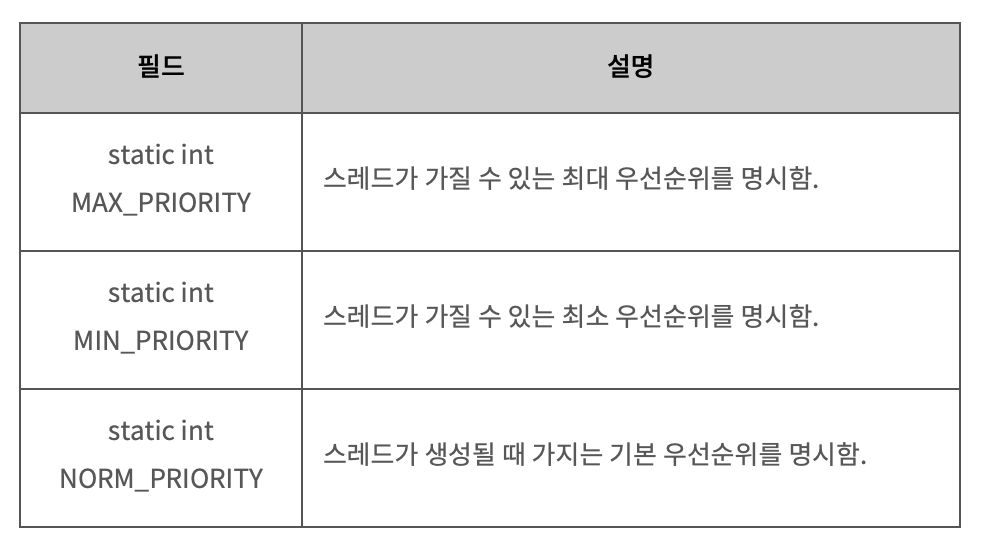

# 스레드란?

> 프로세스 내부에서 실제로 작업을 수행하는 주체를 의미

특징

1. 모든 프로세스는 1개 이상의 스레드가 존재하여 작업 수행
2. 스레드가 여러개 존재하는 것을 멀티 스레드라고 함
3. 멀티스레드에서 각 스레드 끼리는 프로세스의 일정 메모리 영역을 공유
4. 동일한 프로세스 내부의 스레드간 context switching이 프로세스 끼리의 context switching보다 빠르다
    1. 이유 : 상대적으로 스위치해야할 메모리 영역이 적기 때문이다

## 스레드의 생성과 실행

자바에서 스레드를 생성하는 2가지 방법

1. Runnable 인터페이스 구현
    1. Runnable 인터페이스는 구현체가 없는 run()메소드만 가지고 있는 간단한 인터페이스
2. Thread 클래스를 상속

→ run() 메소드에 스레드에서 작업할 내용 작성

## 스레드의 우선순위

- 우선순위에 따라 특정 스레드가 더 많은 시간동안 작업할 수 있도록 설정할 수 있다

- getPriority(), setPriority()메소드를 통해 스레드의 우선순위 반환 및 변경 가능
- 지정 가능한 우선순위의 범위 1~10
    - setPriority메소드를 통해 1~10 범위 내에서 지정하지 않는 경우, `IllegalArgumentException` 예외 발생
- 숫자가 높을수록 우선순위 높음
- main()메소드를 실행하는 스레드의 우선순위는 항상 5
- 기본 스레드의 우선순위 기본값은 5, 다른 모든 스레드의 기본 우선순위는 상위 스레드의 우선순위에 따라 다름
- 주의 : 우선순위가 10인 스레드가 우선순위 1인 스레드보다 10배 더 빨리 수행되는 것을 의미하는 것은 X → 좀더 많이 실행 queue에 포함 & 좀 더 많은 작업시간 할당 받음
- 주의 : 우선순위를 제일 높게 설정한다고 항상 먼저 실행됨을 보장하지 않는다

## 스레드의 상태

| 상태 | 구분 | 내용 |
| --- | --- | --- |
| 초기 상태 | NEW | 스레드 객체를 생성한 상태 |
| 실행 가능 | RUNNABLE | start()메서드로 객체를 호출하여 실행할 수 있는 상태 |
| 실행 중 | RUNNING | 실행가능한 스레드 중에서 스케줄러가 선택하여 스레드가 실행 중인 상태. CPU에 의해 코드가 한줄씩 실행된다. CPU는 n개의 스레드 중 1개밖에 처리할 수 없으며 n-1개의 스레드는 대기상태가 된다 |
| 대기상태 | WATING | 실행 중지. 다른 스레드의 통보(notify)를 기다리는 상태 |
|  | TIMED_WATING | 실행 중지. 주어진 시간동안 대기상태 |
|  | BLOCKED | 다른 스레드에서 락(lock)을 획득한 이유로 락이 걸린 상태 |
| 종료 | TERMINATED | 스레드가 종료된 상태. 한번 종료되면 다시 시작될 수 없다. |

## 스레드 동기화

멀티스레드 프로그램은 스레드끼리 객체를 공유해 작업하는 경우가 있다. 

synchronized 키워드를 사용하면 특정 스레드가 사용중인 객체에 다른 스레드가 접근할 수 없게 되어 동기화가 보장된다. 

synchronized 키워드는 인스턴스, 정적 메서드, 특정 코드 영역 등에 붙일 수 있다.

-  **임계영역(critical section)** 이란 스레드 1개만 실행하거나 접근이 가능한 자원 및 코드의 범위를 말한다.
-  **락(lock)** 이란 공유객체에 여러 스레드가 접근하지 못하게 하는 과정이다. 락은 모든 객체가 메모리 힙 영역에 생성될 때 자동으로 할당된다.
