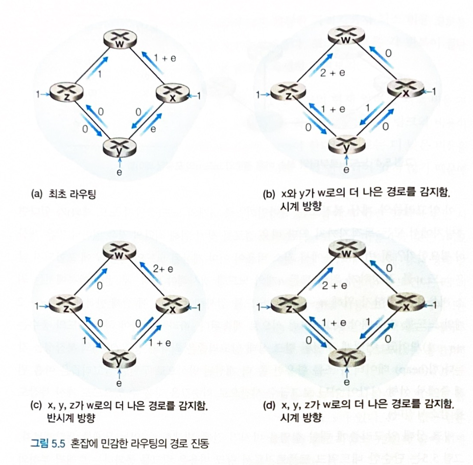

# [컴퓨터 네트워킹 하향식 접근] CHAPTER 8. 네트워크 계층: 제어 평면

### ⏰35min

## 1. 라우팅 알고리즘
### 라우팅 알고리즘은 중앙 집중형과 분산형으로 구분할 수 있다. 각 알고리즘에 대하여 특징을 서술하시오.
(필수 포함 키워드: 링크, 라우터, 비용)

> sol

## 2. 링크상태 라우팅 알고리즘, 거리벡터 라우팅 알고리즘

### 2-1 그림에서 확인할 수 있는 문제에 대해 설명하고, 문제의 원인과 해결방안에 대하여 간단히 설명하시오.
> sol

### 2-2. 거리 벡터 알고리즘의 특징 3가지를 서술하시오.
> sol

### 2-3. 거리 벡터 라우팅 알고리즘에서 링크 비용 변경으로 인해 발생할 수 있는 문제와 원인에 대해 설명하시오.
> sol

## 3. BGP(Border Gateway Protocol)
### 뜨거운 감자 라우팅 알고리즘의 기본 아이디어를 설명하시오.
(포함 키워드 : AS, 비용, 패킷)
> sol

## 4. SDN 컨트롤러 구성요소

### SDN 컨트롤러의 3가지 계층을 제시하고, 각 계층의 역할을 간략히 설명하시오.
> sol

## 5. SDN 컨트롤러 시나리오

<<가정>>
> 스위치s1~s2 사이의 링크가 단절된 경우를 가정 
> 최단경로 알고리즘이 사용되고 있음 
> s1,s3,s4로 들어오고나가는 플로우 포워딩 규칙은 변경되었으나, s2동작은 바뀌지 않음 
> 통신 계층 프로토콜은 OpenFlow가 사용되며, 제어평면은 링크상태 라우팅이외의 기능은 수행하지 않음 

### 5-1. 위의 SDN 시나리오가 라우터별 제어 시나리오와 다른 2가지 차이점을 키워드를 포함하여 설명하시오.
(키워드 : 다익스트라 알고리즘, 링크 갱신 정보)
> sol

### 5-2. 빈칸에 해당하는 적절한 과정을 설명하시오.
1. s2와의 단절을 감지한 s1은 OpenFlow의 포트상태 메세지를 사용하여 링크 상태의 변화를 SDN 컨트롤러에 알린다
2. 메세지를 받은 SDN 컨트롤러는 링크 상태 관리자에게 알리고, 관리자는 링크 상태 DB를 갱신한다
3. 다익스트라 링크상태 라우팅을 담당하는 네트워크 제어 어플리케이션은 링크 상태 변화에 대한 알림을 받는다
4. ( --- )
5. 라우팅 어플리케이션은 갱신되어야 할 플로우 테이블을 결정하는 플로우 테이블 관리자와 접촉한다
6. 플로우 테이블 관리자는 OpenFlow 프로토콜을 사용하여 영향을 받는 스위치들의 플로우 테이블을 갱신
> sol

### 5-3. 6번 과정에서 링크 상태 변화에 영향을 받는 스위치의 번호를 제시하시오.
> sol
